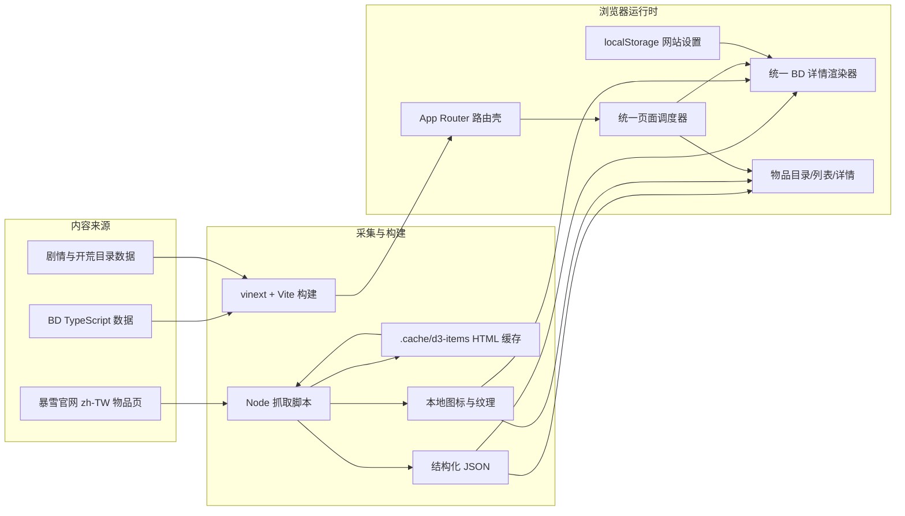

# 技术架构

## 1. 架构目标

项目围绕三个目标设计：

1. 所有 BD 详情使用同一套数据结构和交互组件，避免为每套 BD 编写独立静态页面。
2. 暴雪物品资料在构建前抓取并保存到站内，页面运行时不依赖暴雪官网可用性。
3. 装备、技能、被动、威能和套装之间可以通过统一 ID 建立联动，高亮同一条因果链。

## 2. 总体架构



## 3. 技术栈

| 层级 | 技术 | 用途 |
| --- | --- | --- |
| UI | React 19 | 状态、交互组件、列表和详情渲染 |
| 路由接口 | Next.js 16 App Router | 页面入口、元数据、动态路由目录 |
| 兼容运行时 | vinext | 把 Next 风格应用编译到 Vite/Cloudflare Worker |
| 构建工具 | Vite 8 | 客户端、RSC、SSR 和 Worker 多环境构建 |
| 部署运行时 | Cloudflare Worker | 请求分发和可选图片优化 |
| 语言 | TypeScript / ESM | 页面、数据、构建和 Worker |
| 内容存储 | TypeScript 模块 + JSON + PNG/JPG | BD 数据、物品数据和视觉素材 |
| 数据采集 | Node.js 脚本 | 抓取、缓存、解析和下载官网数据 |
| 可选持久化 | Drizzle ORM + D1 | 已预留，当前业务未启用 |
| 测试 | Node Test Runner | 构建产物、路由 HTML、数据和 CSS 回归 |

## 4. 路由架构

路由目录遵循 App Router 结构，但当前所有业务路由文件都重新导出 `app/page.tsx`：

```text
app/
├── page.tsx
├── builds/page.tsx
├── builds/[id]/page.tsx
├── library/page.tsx
├── library/[category]/page.tsx
├── library/[category]/[id]/page.tsx
├── season-start/page.tsx
└── story/page.tsx
```

`HomeContent` 使用 `usePathname()` 读取路径，再选择对应业务组件：

- `/` 和 `/builds` → `BuildAtlas`
- `/builds/:id` → 查找对应职业的 `BuildGuide`，交给 `UnifiedBuildDetail`
- `/story` → `CampaignRoute`
- `/season-start` → `SeasonStartGuide`
- `/library` → `OfficialLibrary`
- `/library/:category` → `LibraryCategory`
- `/library/:category/:id` → `LibraryRecordDetail`

这种方式保证了早期原型能快速共用全站状态和组件，但也使 `app/page.tsx` 达到约 2700 行。后续维护建议把路由分派、BD 详情、物品系统和全站设置拆成独立组件目录，让 App Router 自己负责参数解析。

## 5. BD 业务架构

### 5.1 数据层

核心类型位于 `app/data/build-guides.ts`。每个 BD 最终都转换为 `BuildGuide`：

- `gear`：装备、词缀优先级、获取方式、避坑和镶嵌。
- `skills` / `passives`：技能、符文、被动与构筑逻辑。
- `powers`：卡奈魔方槽位、原特效、简述和获取方式。
- `variants`：冲层、速刷、低巅峰、高巅峰四类配置说明。
- `links`：BD 因果链节点。
- `rotation`：操作步骤、动作和“为什么这样操作”。

职业数据分散在七个模块中。圣教军、猎魔人、武僧、巫医和魔法师主要使用 `class-build-factory.ts` 的种子数据和工厂函数生成完整 `BuildGuide`；野蛮人、死灵法师包含更多手工校对数据。

### 5.2 渲染层

`UnifiedBuildDetail` 是 49 套构筑共用的详情渲染器，负责：

- 冲层/速刷和低/高巅峰组合状态。
- 根据组合解析装备与卡奈魔方差异。
- 暴雪比例的纸娃娃装备盘。
- 装备悬停预览和点击锁定。
- 主属性、暴击、范围伤等装备词缀反查。
- 技能、符文、被动、装备、威能与联动图同步高亮。
- 自动生成套装家族和皇家华戒联动。
- 三名随从的装备与技能对比。
- 根据构筑数据展示实战手法及原因。

塔格奥死亡新星保留了更完整的定制解析函数，例如 `resolveGear`、`resolvePowers`、`resolveRows` 和 `resolveRotation`。其他构筑没有自定义解析函数时使用统一默认解析逻辑。

### 5.3 物品资料复用

BD 详情加载 `public/d3/library/items.json`，通过装备 ID、图片文件名或映射表寻找官方物品记录。装备详情中的原始特效优先来自结构化物品库；攻略层只保存该装备在当前 BD 中的用途、词缀和获取建议。

## 6. 物品系统架构

物品页面在客户端加载两个静态文件：

- `public/d3/library/item-categories.json`
- `public/d3/library/items.json`

列表和详情共用 `BlizzardItemIcon`，按分类选择 64×64、64×128 或 82×164 的容器，并按普通、传奇、套装品质选择本地背景纹理和边框颜色。

详情页使用以下结构化组件：

- `OfficialPropertySections`：主要、次要、其他分区。
- `OfficialPropertyList`：普通词缀、插槽、随机词缀和嵌套可选组。
- `OfficialSetBlock`：套装名称、部件列表和分档效果。

为兼容 BD 原始特效查找，物品记录暂时同时保留结构化字段与旧的扁平 `effects`、`setBonuses` 字段；新物品 UI 只读取结构化字段。

## 7. 状态管理

项目没有引入外部状态库，使用 React 本地状态和 Context：

- 页面筛选、当前装备、当前联动节点、用途和巅峰均为组件内 `useState`。
- 派生装备、威能、套装家族和高亮 ID 使用 `useMemo`。
- `SiteSettingsContext` 管理七职业纸娃娃性别。
- 性别设置保存在 `localStorage` 的 `sanctuary-site-settings-v1` 中。

这些状态不包含账号或关键业务数据，因此适合保留在浏览器端。

## 8. 静态资源

```text
public/d3/
├── library/
│   ├── classes/          # 职业头像与徽记
│   ├── items/            # 2353 条物品对应的本地图标
│   ├── skills/           # 主动和被动技能图标
│   ├── items.json
│   ├── item-categories.json
│   ├── skills.json
│   ├── gems.json
│   └── manifest.json
├── paperdolls/           # 七职业男女背景
├── item-icon-bgs/        # 暴雪物品品质背景纹理
└── 其他 BD 专用装备、宝石、符文和随从素材
```

运行时物品详情不跳转暴雪官网；图片和物品文本都可由本站静态资源独立提供。BD 页页脚仍可保留外部校对来源链接。

## 9. 构建与运行时

`vite.config.ts` 组合三个插件：

1. `vinext()`：Next App Router 兼容层。
2. `sites()`：构建后把 `.openai/hosting.json` 和 Drizzle 迁移复制到 `dist/.openai`。
3. `@cloudflare/vite-plugin`：生成 Cloudflare Worker 环境。

`worker/index.ts` 负责：

- 把普通请求交给 vinext App Router handler。
- 处理 `/_vinext/image` 图片优化请求。
- 从 Worker 环境接收 `ASSETS`、可选 `DB` 和图片转换能力。

当前 `.openai/hosting.json` 为：

```json
{
  "d1": null,
  "r2": null
}
```

因此当前版本是纯静态内容加客户端交互，不需要数据库或对象存储。

## 10. 质量保障

`npm test` 会先运行完整构建，再对 `dist/server/index.js` 发送请求。当前回归测试覆盖：

- 七职业 49 套 BD 目录完整性。
- 非原型 BD 进入统一详情渲染器。
- 传奇宝石、职业主属性宝石和词缀反查。
- 纸娃娃精确像素几何、装备槽位置和暴雪图标样式。
- 2353 条物品、55 个分类和本地详情 UI。
- 黑荆棘裤子的主要/次要属性、3/7 选项组、5 件套装清单和 2/3/4 件效果。

## 11. 已知技术债与改进顺序

1. **拆分单体页面文件**：`app/page.tsx` 和 `app/globals.css` 过大，应按业务域拆分。
2. **让 App Router 直接解析参数**：动态路由应从 `params` 读取参数，减少手工 pathname 分派。
3. **避免全量加载物品 JSON**：当前 BD 和物品页面会加载完整 2353 条记录，可按分类拆包或生成 ID 索引。
4. **建立赛季配置中心**：把赛季号、补丁号、平台基准和第四魔方槽规则从页面文字中抽离。
5. **收敛兼容字段**：确认所有消费者切换到结构化物品字段后，删除扁平 `effects`、`setBonuses`。
6. **抓取器契约测试**：把关键官网 HTML 固化为脱敏测试夹具，避免官网 DOM 变化后静默丢字段。
7. **统一构筑差异模型**：把所有低/高巅峰、冲层/速刷的具体装备变化显式写入数据，而不是依赖默认替换规则。

