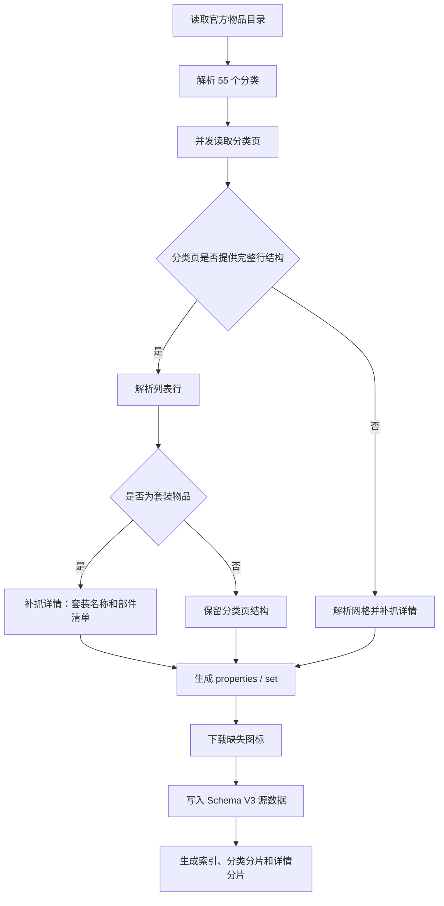

# 数据采集与更新

## 1. 目标

物品采集流程把暴雪繁中物品目录转换为本站可离线使用的结构化数据和本地图标。运行时页面只读取 `public/d3/library`，不会在用户浏览时请求暴雪物品详情。

官方入口：`https://eu.diablo3.blizzard.com/zh-tw/item/`。

## 2. 相关文件

| 文件 | 用途 |
| --- | --- |
| `scripts/scrape-diablo-items.mjs` | 全量/增量抓取、解析、下载图标和生成 JSON |
| `scripts/build-item-library.mjs` | 从完整记录生成 Schema V3、分类分片、详情分片和索引 |
| `scripts/inspect-diablo-item.mjs` | 离线检查单个缓存详情页的结构化结果 |
| `.cache/d3-items/` | 官网目录和详情 HTML 缓存，不作为运行时资源 |
| `public/d3/library/items.json` | 2353 条结构化源记录，不由页面运行时加载 |
| `public/d3/library/items/index.json` | 列表字段索引 |
| `public/d3/library/items/asset-index.json` | BD 装备图片到官方 ID 的轻量索引 |
| `public/d3/library/items/by-category/` | 55 个分类运行时分片 |
| `public/d3/library/items/detail/` | 2353 个单物品详情分片 |
| `public/d3/library/item-categories.json` | 55 个目录分类 |
| `public/d3/library/items/` | 本地图标 |
| `public/d3/item-icon-bgs/` | 普通、传奇、套装品质背景纹理 |

## 3. 处理流程



套装必须补抓详情页，因为目录列表只提供部分套装效果，不提供套装名称和完整部件清单。普通与传奇物品优先直接使用分类页内容，避免为 2353 件物品逐一请求详情。

## 4. HTML 解析策略

暴雪属性列表包含嵌套 `<ul>`。简单的非贪婪正则会在第一个内部 `</ul>` 提前结束，导致后面的可选词缀和随机词缀丢失。

抓取器使用 `extractElementByClass()`：

1. 找到带指定 class 的起始标签。
2. 识别元素标签名。
3. 对相同标签的开始/结束标记进行深度计数。
4. 深度回到 0 时返回完整元素。

在此基础上：

- `parseItemProperties()` 拆分主要、次要、其他。
- `parseChoiceGroup()` 保留嵌套候选项。
- `parseItemSet()` 拆分套装名称、部件、当前物品和档位。
- `writeItemLibraryOutputs()` 删除旧投影，只保留结构化字段并生成运行时分片。

## 5. 常用命令

### 5.1 全量更新

```bash
npm run scrape:items
```

会读取 55 个分类、补抓套装详情、下载缺失图标并重写两个 JSON 文件。

### 5.2 只更新指定分类

```bash
node scripts/scrape-diablo-items.mjs --only=pants
```

多个分类使用逗号：

```bash
node scripts/scrape-diablo-items.mjs --only=pants,helm,ring
```

增量模式会保留未包含分类的现有记录。

### 5.3 只刷新数据，不下载图标

```bash
node scripts/scrape-diablo-items.mjs --skip-images
```

适用于修改解析器后快速重新生成 JSON。

### 5.4 忽略缓存重新请求

```bash
node scripts/scrape-diablo-items.mjs --refresh
```

应谨慎使用。优先用单分类验证，确认官网结构变化后再全量刷新。

### 5.5 检查单件物品

```bash
node scripts/inspect-diablo-item.mjs \
  .cache/d3-items/detail-<item-id>.html \
  https://eu.diablo3.blizzard.com/zh-tw/item/<item-id>
```

输出仅包含 `properties` 和 `set`，适合验证解析器而不改写全量 JSON。

### 5.6 仅重建本地分片

```bash
npm run build:item-library
```

该命令不访问网络，用现有 `items.json` 重建 Schema V3、索引、分类分片和详情分片。

## 6. 推荐更新流程

1. 选取一件包含嵌套词缀和套装效果的复杂样本。
2. 使用缓存详情和 `inspect-diablo-item.mjs` 调整解析器。
3. 确认主要/次要、候选组、随机词缀、套装清单和各档效果均正确。
4. 使用 `--only=<category> --skip-images` 更新一个分类。
5. 检查生成 JSON 和对应页面。
6. 运行全量 `--skip-images`。
7. 如官网新增图标，再运行不带 `--skip-images` 的全量命令。
8. 运行 `npm test`。

黑荆棘的锁甲马裤是当前回归样本，预期结构：

- 等级 60，397–471 防具。
- 次要属性包含 2 孔、3 选 1、7 选 1、3 个随机属性。
- 套装包含 5 件物品。
- 套装档位为 2/3/4 件，效果行数分别为 2/2/1。

## 7. 全量数据校验

更新后至少确认：

- 记录总数为 2353，分类总数为 55；如果官网确实变化，应同步修改测试预期并记录原因。
- 所有记录 `schemaVersion === 3`，且不存在 `effects`、`setBonuses`。
- 所有 ID 唯一，所有 `image` 指向的本地文件存在。
- 每个 choice 的 `count === options.length`。
- 主要/次要标题没有混入普通属性文本。
- 套装档位按件数组织，不再是一段未换行文本。
- 每件实际套装装备恰好有一个 `current: true`。
- 传奇特效在 UI 中只显示一次。
- 设计图没有被误判为套装装备清单。

当前自动测试已覆盖总数、黑荆棘结构、choice 数量、分片引用，以及五类固定 HTML 夹具。

## 8. 缓存与网络故障

- 默认优先读取 `.cache/d3-items`，因此解析器迭代通常无需联网。
- 请求失败会最多重试三次，并逐步延迟。
- 单个图标已存在时不会重复下载。
- 官网 DOM 改版可能导致分类变成空数组；遇到总数大幅下降时不要覆盖已知正确数据，应先用单分类和单件检查定位选择器变化。
- `.cache` 只用于开发，页面不能引用其中的文件。

## 9. 语言与结构化字段

官网来源为繁体中文 `zh-TW`，攻略 UI 为简体中文。官方物品名称和特效默认保留来源文本，避免自行翻译引入数值或语义偏差。

页面、BD 原特效选择器和测试统一读取 `properties`、`legendaryPower` 与 `set`。Schema V3 不再生成 `effects`、`setBonuses` 两套扁平真相。
